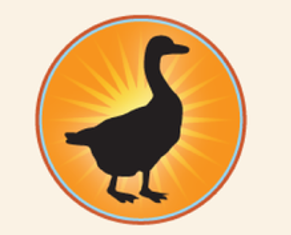

# Lab 1: Basic HTML Elements

## Lab Objectives
- Practice fundamental HTML tags: headings, paragraphs, images, lists, preformatted text, font (deprecated), HR, maps.
- Build simple static pages with links, alignments, and basic structure.
- Understand rendering in browsers.

Tasks (from provided images and solutions):
1. Font tag example.
2. Preformatted C program code.
3. Personal page with image and story.
4. Nested ordered lists (fruits/vegetables).
5. Image map with social links.
6. Bistro page with centered logo, headings, and HR.

## Project Structure
```
lab-01/
├── task1.html       # Font tag demo
├── task2.html       # Preformatted C code
├── task3.html       # Ricardo's dog page
├── task4.html       # Nested lists
├── task5.html       # Image map with links
├── task6.html       # Black Goose Bistro page
├── assets/          # Images (img.png, icon.png, logo.png, ass5.jpg)
└── README.md        # This file
```

## Key Highlights
Here are snippets from standout tasks. For full code, open the .html files in a browser.

### Task 4: Nested Ordered Lists
```html
<ol>
    <li>Fruits
        <ol>
            <li>Mango</li>
            <li>Orange</li>
        </ol>
    </li>    
    <li>Vegetables
        <ol>
            <li>Cabbage</li>
            <li>Capsicum
                <ol>
                    <li>Green Capsicum</li>
                    <li>Yellow Capsicum</li>
                    <li>Red Capsicum</li>
                </ol>
            </li>
        </ol>
    </li>    
</ol>
```

   **Explanation**: Demonstrates ordered lists with nesting for hierarchy.  
   **Sample Output**: (See provided image of fruits/vegetables list.)

### Task 5: Image Map
```html

<map name="mymap">
    <area shape="rect" coords="90,38,284,76" href="https://facebook.com">
    <area shape="circle" coords="111,109,50" href="https://youtube.com">
    <area shape="poly" coords="91,167, 88,196, 281,195, 286,166" href="https://instagram.com">
</map>
```

   **Explanation**: Creates clickable areas on an image linking to social sites.  
   **Sample Output**: Interactive image with regions (see social icons image).

### Task 6: Bistro Page
```html
<div align="center"></div>
<p align="center"><font size="5"><b>BLACK GOOSE BISTRO</b></font></p>
<hr color="cyan" width="800"/>
<h2><font color="red">The Restaurant</font></h2>
<p>The Black Goose Bistro offers casual lunch and dinner fare in a hip atmosphere. The menu changes regularly to highlight the freshest ingredients.</p>
<!-- More sections... -->
```

   **Explanation**: Basic layout with centering, colors, and HR for separation.  
   **Sample Output**: (See provided bistro page screenshot.)

## Notes
- Labs use deprecated tags (e.g., font, align) for educational purposes—modern CSS preferred.
- Test in browser; no JS/CSS in this lab.
- Outputs match provided images (e.g., lists, font examples, bistro page).

Foundational HTML practice! 🚀